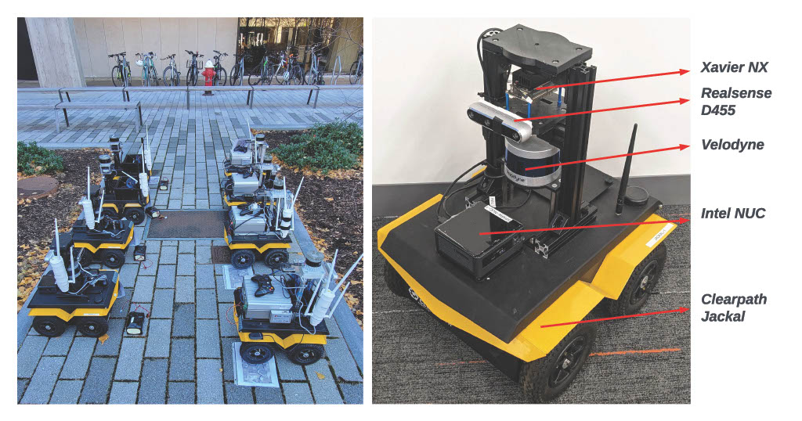
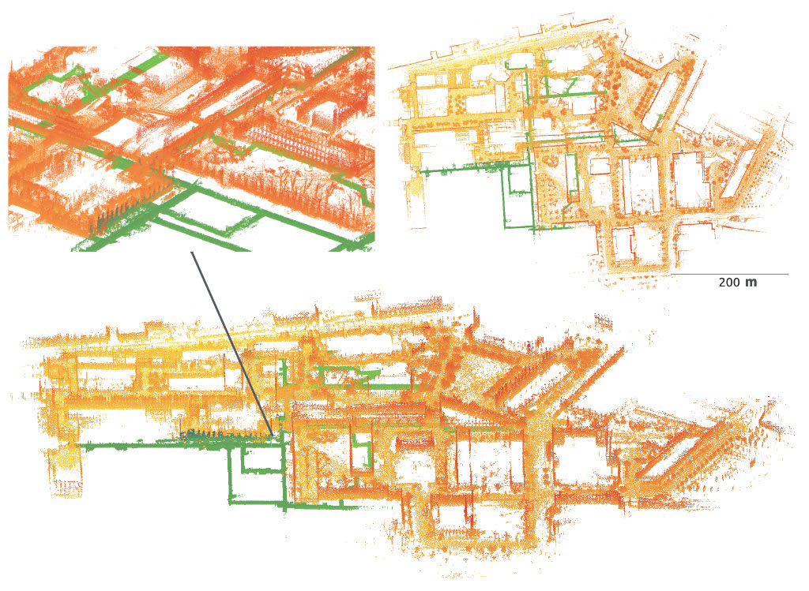
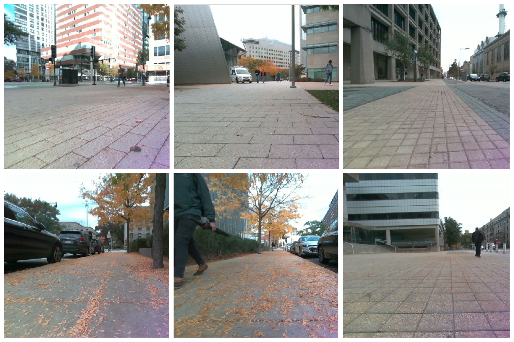
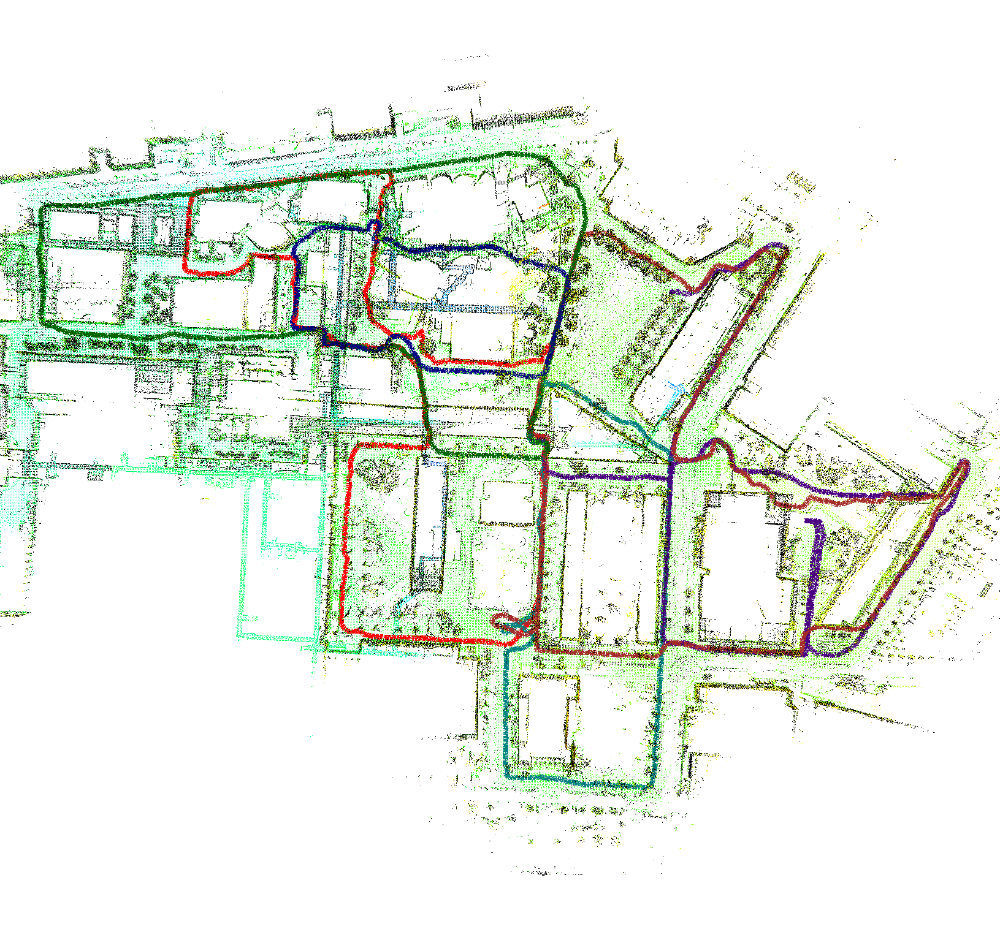
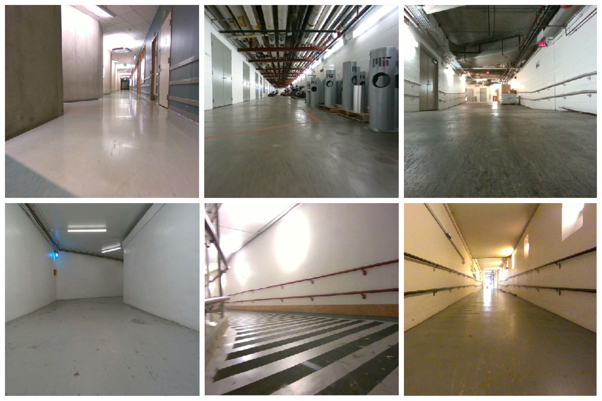
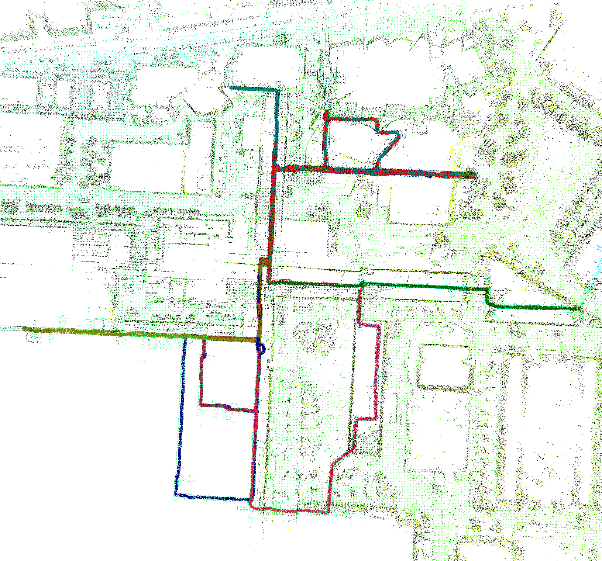
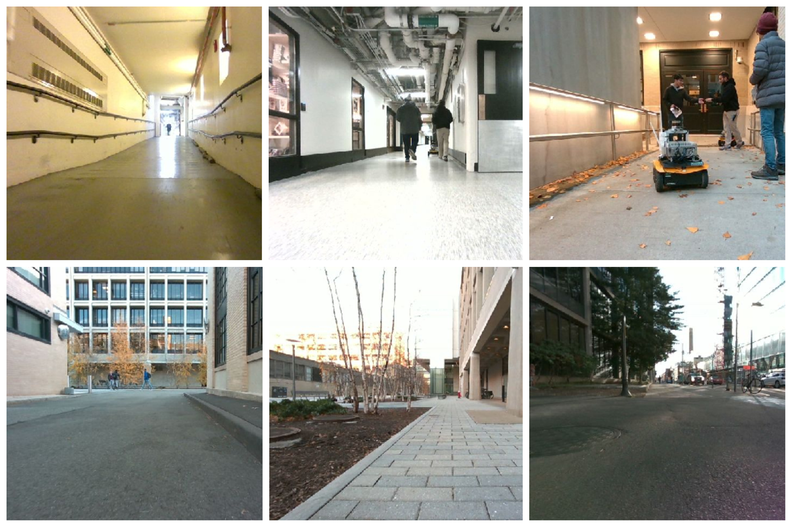
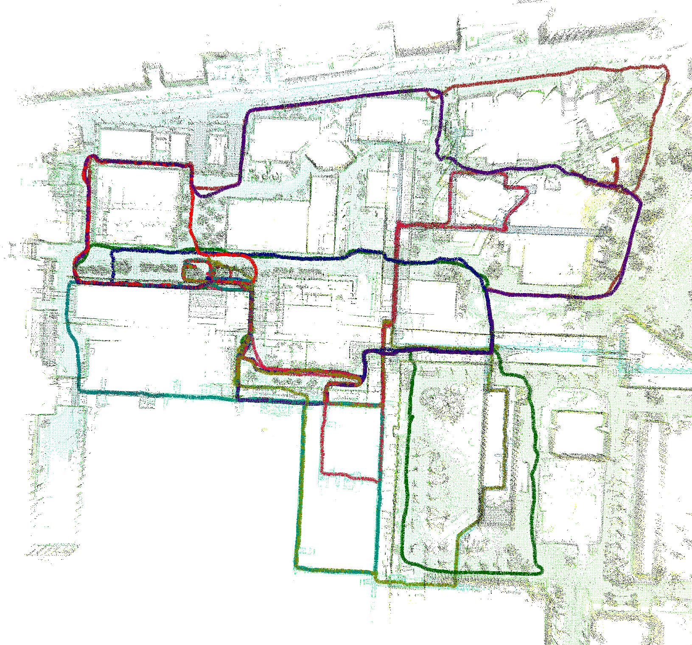

# Kimera-Multi-Data: A large-Scale Multi-Robot Dataset for Multi-Robot SLAM 
> **Note**
> Due to privacy issues, the datasets are currently being processed to remove any faces or private information.
The datasets are scheduled to be ready by April 5th, 2023.

## Description:

|  Sequence        |  # Robots  |  Traversal (m)    |  Duration (min)  | 
| ---------------- | ---------- | ----------------- | ---------------- |
|  Campus-Outdoor  |  6         |  6044             |  19              | 
|  Campus-Tunnels  |  8         |  6753             |  28              | 
|  Campus-Hybrid   |  8         |  7785             |  27              |

## Platforms

  

### Data format

| Topic                                         | Type                        | Description                        |
| --------------------------------------------- | --------------------------- | ---------------------------------- |
| /xxx/forward/color/image_raw/compressed       | sensor_msgs/CompressedImage | RGB Image from D455                |
| /xxx/forward/color/camera_info                | sensor_msgs/CameraInfo      | RGB Image Camera Info              |
| /xxx/forward/depth/image_rect_raw             | sensor_msgs/Image           | Depth Image from D455              |
| /xxx/forward/depth/camera_info                | sensor_msgs/CameraInfo      | Depth Image Camera Info            |
| /xxx/forward/infra1/image_rect_raw/compressed | sensor_msgs/CompressedImage | Compressed Gray Scale Stereo Left  |
| /xxx/forward/infra1/camera_info               | sensor_msgs/CameraInfo      | Stereo Left Camera Info            |
| /xxx/forward/infra2/image_rect_raw/compressed | sensor_msgs/CompressedImage | Compressed Gray Scale Stereo Right |
| /xxx/forward/infra2/camera_info               | sensor_msgs/CameraInfo      | Stereo Right Camera Info           |
| /xxx/forward/imu                              | sensor_msgs/Imu             | IMU from D455                      |
| /xxx/jackal_velocity_controller/odom          | nav_msgs/Odometry           | Wheel Odometry                     |
| /xxx/lidar_points                             | sensor_msgs/PointCloud2     | Lidar Point Cloud                  |

## Ground Truth

  

## Calibration

We provide the calibration between the sensors.

## Citation

## Download
Due to Institute policy, we cannot directly post the links for dataset download.
Please click on the link below and fill out the form. We will try to respond with the link as soon as possible.

| Name | Rosbags | GT | Photos | Trajectory | 
|:-:|:-:|:-:|:-:|:-:|
| Campus-Outdoor | [request](https://forms.gle/EBHJE3LEKkTsnABu7)  | [link](https://drive.google.com/drive/folders/1Pcmm3OVWVAMJvRtRbfHy1H6ecl4VZ07b?usp=share_link) |  |  |
| Campus-Tunnels | [request](https://forms.gle/EBHJE3LEKkTsnABu7)  | [link](https://drive.google.com/drive/folders/1pewS3on3ZUma5BqjwP_yg3u-nwBghMzr?usp=share_link) |  |  | 
| Campus-Hybrid  | [request](https://forms.gle/EBHJE3LEKkTsnABu7)  | [link](https://drive.google.com/drive/folders/1Gyw9E8j_9zlzklhPFy4VcKsgnr6oSiu1?usp=share_link) |   |  |
